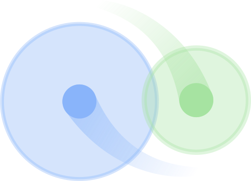

<!-- Improved compatibility of back to top link: See: https://github.com/othneildrew/Best-README-Template/pull/73 -->
<a name="readme-top"></a>
<!-- PROJECT LOGO -->
<br />
<div align="center">
  <a href="https://github.com/github_username/repo_name">
    
  </a>

<h3 align="center">chirpdetector</h3>

  <p align="center">
    An algorithm to detect the chirps of weakly electric fish on multielectrode recordings.
    <br />
    <a href="https://github.com/github_username/repo_name"><strong>Explore the docs »</strong></a>
    <br />
    <br />
    <a href="https://github.com/github_username/repo_name">View Demo</a>
    ·
    <a href="https://github.com/github_username/repo_name/issues">Report Bug</a>
    ·
    <a href="https://github.com/github_username/repo_name/issues">Request Feature</a>
  </p>
</div>

<!-- TABLE OF CONTENTS -->
<details>
  <summary>Table of Contents</summary>
  <ol>
    <li><a href="#about-the-project">About The Project</a></li>
    <li><a href="#getting-started">Getting Started</a></li>
    <li><a href="#usage">Usage</a></li>
    <li><a href="#to-do">Roadmap</a></li>
  </ol>
</details>


## About The Project

[![Product Name Screen Shot][product-screenshot]](https://example.com)

Here's a blank template to get started: To avoid retyping too much info. Do a search and replace with your text editor for the following: `github_username`, `repo_name`, `twitter_handle`, `linkedin_username`, `email_client`, `email`, `project_title`, `project_description`

<p align="right">(<a href="#readme-top">back to top</a>)</p>


## Getting Started

This is an example of how you may give instructions on setting up your project locally.
To get a local copy up and running follow these simple example steps.

<p align="right">(<a href="#readme-top">back to top</a>)</p>

<!-- USAGE EXAMPLES -->
## Usage

Use this space to show useful examples of how a project can be used. Additional screenshots, code examples and demos work well in this space. You may also link to more resources.

_For more examples, please refer to the [Documentation](https://example.com)_

<p align="right">(<a href="#readme-top">back to top</a>)</p>


## To do

- [ ] Feature 1
- [ ] Feature 2
- [ ] Feature 3
    - [ ] Nested Feature

<p align="right">(<a href="#readme-top">back to top</a>)</p>


<!-- # Chirp detection - GP2023 -->
<!-- ## Git-Repository and commands -->

<!-- - Go to the [Bendalab Git-Server](https://whale.am28.uni-tuebingen.de/git/) (https://whale.am28.uni-tuebingen.de/git/) -->
<!-- - Create your own account (and tell me ;D) -->
<!--   * I'll invite you the repository -->
<!-- - Clone the repository -->
<!-- -  -->
<!-- ```sh -->
<!-- git clone https://whale.am28.uni-tuebingen.de/git/raab/GP2023_chirp_detection.git -->
<!-- ``` -->

<!-- ## Basic git commands -->

<!-- - pull changes in git -->
<!-- ```shell -->
<!-- git pull origin <branch> -->
<!-- ``` -->
<!-- - commit chances -->
<!-- ```shell -->
<!-- git commit -m '<explaination>' file  # commit one file -->
<!-- git commit -a -m '<explaination>'    # commit all files -->
<!-- ``` -->
<!-- - push commits -->
<!-- ```shell -->
<!-- git push origin <branch> -->
<!-- ``` -->

<!-- ## Branches -->
<!-- Use branches to work on specific topics (e.g. 'algorithm', 'analysis', 'writing', ore even more specific ones) and merge -->
<!-- them into Master-Branch when it works are up to your expectations. -->

<!-- The "master" branch should always contain a working/correct version of your project. -->

<!-- - Create/change into branches -->
<!-- ```shell -->
<!-- # list all branches (highlight active branch) -->
<!-- git banch -a            -->
<!-- # switch into existing           -->
<!-- git checkout <existing branch>    -->
<!-- # switch into new branch -->
<!-- git checkout master -->
<!-- git checkout -b <new branch>      -->
<!-- ``` -->


<!-- - Re-merging with master branch -->
<!-- 1) get current version of master and implement it into branch -->
<!-- ```shell -->
<!-- git checkout master -->
<!-- git pull origin master -->
<!-- git checkout <branch> -->
<!-- git rebase master -->
<!-- ``` -->
<!-- This resets you branch to the fork-point, executes all commits of the current master before adding the commits of you  -->
<!-- branch. You may have to resolve potential conflicts. Afterwards commit the corrected version and push it to your branch. -->

<!-- 2) Update master branch master -->
<!-- - correct way: Create -->
<!-- ```shell -->
<!-- git checkout master -->
<!-- git merge <branch> -->
<!-- git push origin master -->
<!-- ``` -->


<!-- MARKDOWN LINKS & IMAGES -->
<!-- https://www.markdownguide.org/basic-syntax/#reference-style-links -->
[contributors-shield]: https://img.shields.io/github/contributors/github_username/repo_name.svg?style=for-the-badge
[contributors-url]: https://github.com/github_username/repo_name/graphs/contributors
[forks-shield]: https://img.shields.io/github/forks/github_username/repo_name.svg?style=for-the-badge
[forks-url]: https://github.com/github_username/repo_name/network/members
[stars-shield]: https://img.shields.io/github/stars/github_username/repo_name.svg?style=for-the-badge
[stars-url]: https://github.com/github_username/repo_name/stargazers
[issues-shield]: https://img.shields.io/github/issues/github_username/repo_name.svg?style=for-the-badge
[issues-url]: https://github.com/github_username/repo_name/issues
[license-shield]: https://img.shields.io/github/license/github_username/repo_name.svg?style=for-the-badge
[license-url]: https://github.com/github_username/repo_name/blob/master/LICENSE.txt
[linkedin-shield]: https://img.shields.io/badge/-LinkedIn-black.svg?style=for-the-badge&logo=linkedin&colorB=555
[linkedin-url]: https://linkedin.com/in/linkedin_username
[product-screenshot]: images/screenshot.png
[Next.js]: https://img.shields.io/badge/next.js-000000?style=for-the-badge&logo=nextdotjs&logoColor=white
[Next-url]: https://nextjs.org/
[React.js]: https://img.shields.io/badge/React-20232A?style=for-the-badge&logo=react&logoColor=61DAFB
[React-url]: https://reactjs.org/
[Vue.js]: https://img.shields.io/badge/Vue.js-35495E?style=for-the-badge&logo=vuedotjs&logoColor=4FC08D
[Vue-url]: https://vuejs.org/
[Angular.io]: https://img.shields.io/badge/Angular-DD0031?style=for-the-badge&logo=angular&logoColor=white
[Angular-url]: https://angular.io/
[Svelte.dev]: https://img.shields.io/badge/Svelte-4A4A55?style=for-the-badge&logo=svelte&logoColor=FF3E00
[Svelte-url]: https://svelte.dev/
[Laravel.com]: https://img.shields.io/badge/Laravel-FF2D20?style=for-the-badge&logo=laravel&logoColor=white
[Laravel-url]: https://laravel.com
[Bootstrap.com]: https://img.shields.io/badge/Bootstrap-563D7C?style=for-the-badge&logo=bootstrap&logoColor=white
[Bootstrap-url]: https://getbootstrap.com
[JQuery.com]: https://img.shields.io/badge/jQuery-0769AD?style=for-the-badge&logo=jquery&logoColor=white
[JQuery-url]: https://jquery.com


