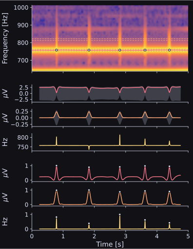
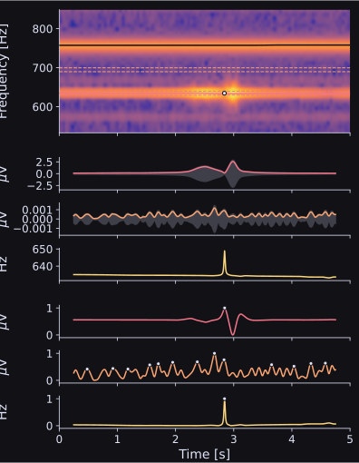
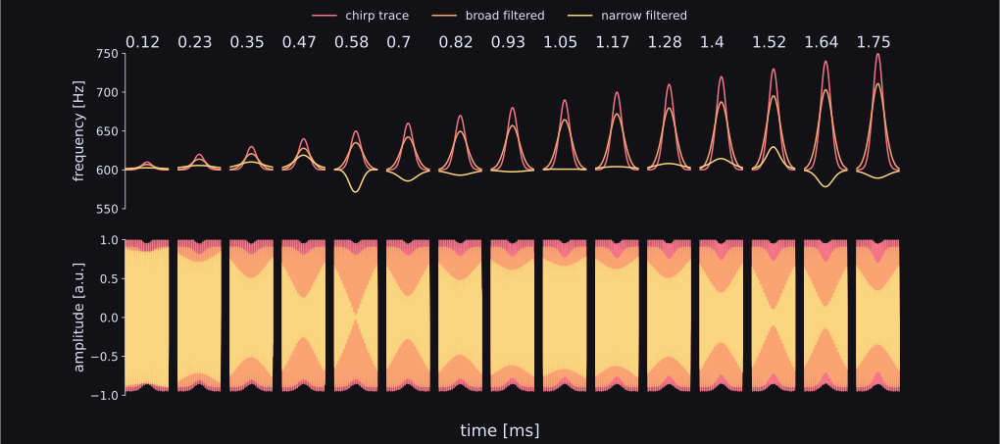

# Chirpdetector

Chirps are transient communication singals of many wave-type electric fish. Because they are so fast, detecting them when the recorded signal includes multiple individuals is hard. But to understand if, and what kind of information they transmit in a natural setting, analyzing chirps in multiple freely interacting individual is nessecary. This repository documents an approach to detect these signals on electrode grid recordings with many freely behaving individuals by extracting EOD parameters that change during a chirp and detecting anomalies on them.

The majority of the code and its tests were part of a lab rotation with the [Neuroethology](https://github.com/bendalab) at the University of Tuebingen. It also contains a [poster](poster_printed/main.pdf) and a more thorough [lab protocol](protocol/main.pdf).

## The Approach

To detect chirps, we extract some features of the raw signal using frequency traces that were computed beforehand using the [wavetracker](https://github.com/tillraab/wavetracker). For a frequency band of a single fish, we filter the signal using a bandpass filter, extract the instantaneous frequency, the envelelope and the envelope of a frequency band slightly above the fundamental frequency of the fish. We then transform those features using various filters and detect the peaks on them. Peaks on all three features are chirps. In an ideal world, the result looks like this: 



We always use the strongest electrode relative to the fish of interest. By that, we include the spatial demensions to increase our detection performance, if fish are spaced sufficiently apart. The full algorithm is thoroughly explained in the lab protocol. All parameters can be tuned using a `yaml` config file. While this approach excels in assigning detected chirps to the currect fish, the actial chirp detection is not that reliable. If peak detection thresholds are set for each feature manually, the detector can become quite reliable but performance will be sensible to changes in the recording setup. But if features are normalized to generalize the detector, noise often introduces false detections, especially during amplitude breakdowns. Below is an example of a recording with false detections: 



## Open questions 

One of the three features we exract to detect peaks is the instantaneous frequency of the baseline EOD of a single fish. To do that, we apply a narrow bandpass filter (+- 5 Hz) around the fundamental frequency in a single 5 second window. If when the fish chirps, its real frequency should increase beyond the filter cutoff frequencies and we should see a slight increase in the instantaneous frequency. But sometimes, the frequency decreases or does not change at all.

To understand this, we simulated chirps while changing some parameters of the chirp, notably the height, width, kurtosis, contrast and EOD phase in which the chirp is produced. What we find, is that all parameters that change the integral of the chirp frequency evolution (i.e. the height, width, and kurtosis) occasionally result in negative instantaneous frequencies in the narrow filtered EOD. Specifically, if the integral increases, the instantaneous frequency increases as well, until an integer + 0.57 is reached. At this point, the frequency flips around the x axis and gradually becomes positive again. This is illustrated in the figure below for the chirp width. The integral of the zero-shifted instantaneous frequency is indicated as the title of each subplot. 1.57 would be $\pi/2$ but how this relates to the observed pattern is not clear yet. What becomes clear from the waveform below is that the point at which the EOD flips is the point where the amplitude of just the filtered signal breaks down to 0.



To explore the other parameters, there is a jupyter notebook in the `notebooks` [here](chirp_instantaneous_freq/chirp_exploration.ipynb).

<!-- # Chirp detection - GP2023 -->
<!-- ## Git-Repository and commands -->

<!-- - Go to the [Bendalab Git-Server](https://whale.am28.uni-tuebingen.de/git/) (https://whale.am28.uni-tuebingen.de/git/) -->
<!-- - Create your own account (and tell me ;D) -->
<!--   * I'll invite you the repository -->
<!-- - Clone the repository -->
<!-- -  -->
<!-- ```sh -->
<!-- git clone https://whale.am28.uni-tuebingen.de/git/raab/GP2023_chirp_detection.git -->
<!-- ``` -->

<!-- ## Basic git commands -->

<!-- - pull changes in git -->
<!-- ```shell -->
<!-- git pull origin <branch> -->
<!-- ``` -->
<!-- - commit chances -->
<!-- ```shell -->
<!-- git commit -m '<explaination>' file  # commit one file -->
<!-- git commit -a -m '<explaination>'    # commit all files -->
<!-- ``` -->
<!-- - push commits -->
<!-- ```shell -->
<!-- git push origin <branch> -->
<!-- ``` -->

<!-- ## Branches -->
<!-- Use branches to work on specific topics (e.g. 'algorithm', 'analysis', 'writing', ore even more specific ones) and merge -->
<!-- them into Master-Branch when it works are up to your expectations. -->

<!-- The "master" branch should always contain a working/correct version of your project. -->

<!-- - Create/change into branches -->
<!-- ```shell -->
<!-- # list all branches (highlight active branch) -->
<!-- git banch -a            -->
<!-- # switch into existing           -->
<!-- git checkout <existing branch>    -->
<!-- # switch into new branch -->
<!-- git checkout master -->
<!-- git checkout -b <new branch>      -->
<!-- ``` -->


<!-- - Re-merging with master branch -->
<!-- 1) get current version of master and implement it into branch -->
<!-- ```shell -->
<!-- git checkout master -->
<!-- git pull origin master -->
<!-- git checkout <branch> -->
<!-- git rebase master -->
<!-- ``` -->
<!-- This resets you branch to the fork-point, executes all commits of the current master before adding the commits of you  -->
<!-- branch. You may have to resolve potential conflicts. Afterwards commit the corrected version and push it to your branch. -->

<!-- 2) Update master branch master -->
<!-- - correct way: Create -->
<!-- ```shell -->
<!-- git checkout master -->
<!-- git merge <branch> -->
<!-- git push origin master -->
<!-- ``` -->